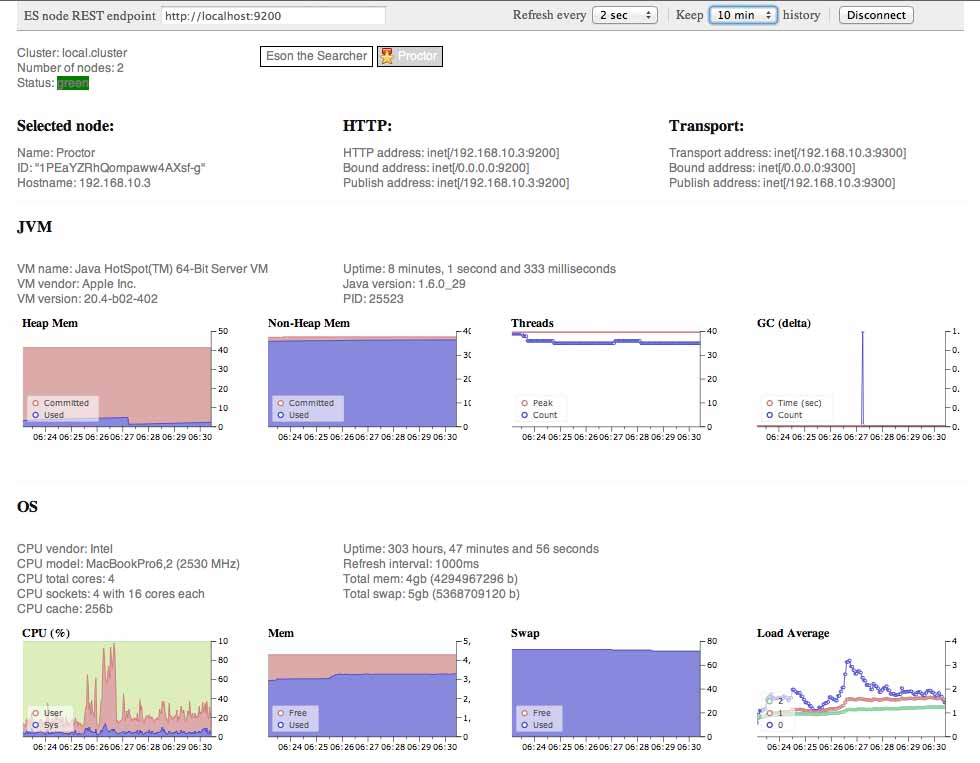

In simple words **bigdesk** makes it very easy to see how your elasticsearch cluster is doing. Just install it as an [elasticsearch plugin](#elasticsearch_plugin) or [download localy](#download_localy) or run [from the web](#from_the_web), then point it to the elasticsearch node REST endpoint and **have fun**. 

*****



It pulls data from elasticsearch REST API and turns it into charts. Currently it supports elasticsearch **0.19** and **0.20** (there is also [support][github-readme] for 0.17 and 0.18).

[github-readme]: https://github.com/lukas-vlcek/bigdesk/blob/master/README.textile

*****

### elasticsearch plugin

To install bigdesk master branch as [elasticsearch plugin](http://www.elasticsearch.org/guide/reference/modules/plugins.html) on particular elasticsearch node, navigate to the node installation folder and run the following command:

```
bin/plugin -install lukas-vlcek/bigdesk
```

To install specific version (for example 1.0.0) run:

```
bin/plugin -install lukas-vlcek/bigdesk/1.0.0
```

Then you can navigate your web browser to `http://<xx>/_plugin/bigdesk/`

*****

### download localy

Download bigdesk master as [zipball](https://github.com/lukas-vlcek/bigdesk/zipball/master) or [tarball](https://github.com/lukas-vlcek/bigdesk/tarball/master) and extract the archive. Alternatively, you can clone git repository from GitHub:

```
git clone git://github.com/lukas-vlcek/bigdesk.git bigdesk
```

Then simply open `bigdesk/index.html` in your web broswer.

*****

### from the web

This feature allows you to run bigdesk directly from the web without need to install it anywhere. Just [select version](v) you want to use and you are ready to go.

*****

### URL parameters

You can use URL parameters to immediately **connect** to a particular **endpoint** or set **history** and **refresh** interval:

##### &mdash; endpoint
URL of elasticsearch node REST endpoint (you might want to use URL encoded value). Defaults to `http://localhost:9200`.

##### &mdash; connect
If set to `true` bigdesk will try to connect immediately to the endpoint. Defaults to `false`.

##### &mdash; refresh
Refresh interval in milliseconds. Defaults to `2000` (2 sec).

##### &mdash; history
How much data in milliseconds to keep in history. Defaults to `300000` (5 min).

For example to open bigdesk and have it connected to `http://127.0.0.1:9201` endpoint with `3` sec refresh interval use:

`index.html?endpoint=http://127.0.0.1:9201&connect=true&refresh=3000`

### web browser support

A modern web browsers with SVG support is needed. It has been tested in Safari, Firefox and Chrome.

